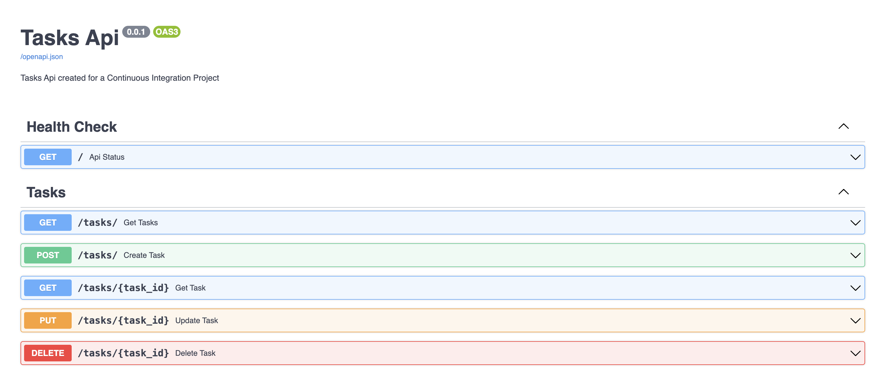
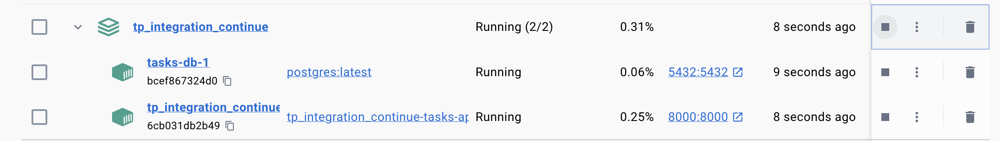
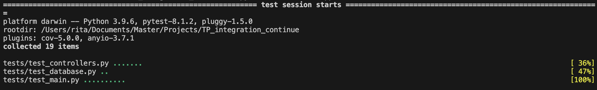
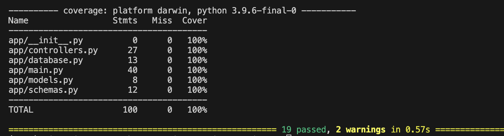
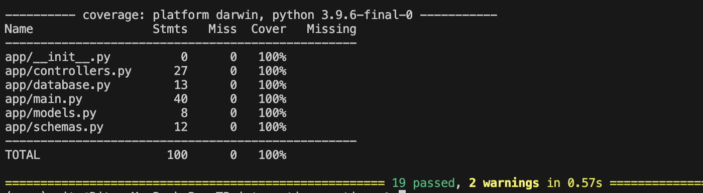

## TP - Intégration Continue (ICDE849)
Mise en oeuvre d'une chaine d'intégration continue.

## Participants 👥
- BILLARD Mélissa
- BRACCIALES-COMBAS Lola
- CARRILHO LAMEIRA Rita

## Technologie 
- Api en [FastApi](https://fastapi.tiangolo.com/)

## Endpoints de l'API



## Docker

1) Build container : ```docker-compose build```


2) Test avec coverage : ```docker-compose up```




## Exécution de lint
- [Pylint](https://pylint.readthedocs.io/en/latest/index.html)

```cmd
pylint app/*.py
```


## Présentation des Tests et Instructions d'Exécution

- [Pytest](https://docs.pytest.org/en/8.2.x/)


### Exécuter les tests
**TOTAL** : 19 tests.
**COVERAGE** : 100%.

1) Test standard : ```pytest tests```



2) Test avec coverage : ```pytest tests --cov=app```



3) Test avec coverage : ```pytest tests--cov-report=term-missing ```



## Commandes utiles
### Lancer le projet en local
```java
python3 -m venv venv
source venv/bin/activate
uvicorn app.main:app --host 0.0.0.0 --port 8000
uvicorn app.main:app --reload   
```
### Postgres
```java
// installation de postgresql sur MacOS
brew services start postgresql
// lancer serveur postgresql en local
psql postgres
// configuration
CREATE USER taskuser WITH PASSWORD 'taskpassword';
CREATE DATABASE taskdb;
GRANT ALL PRIVILEGES ON DATABASE taskdb TO taskuser;
```
### Effacer fichiers DS_Store
```java
find . -name .DS_Store -print0 | xargs -0 git rm -f --ignore-unmatch
```
